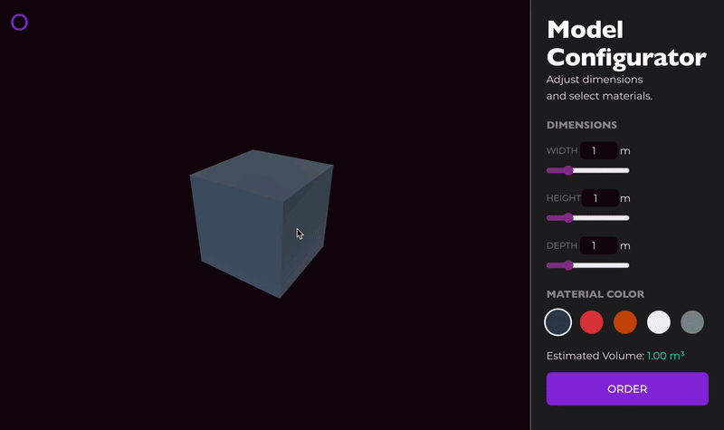

# Parametric 3D Viewer | Vue 3 |  [Live Demo]()
A quick prototype to demonstrate Vue 3 reactivity integrated with a Three.js rendering engine.


-hotpink?style=for-the-badge&logo=sass&logoColor=white)


## Architecture

```bash
├── src/
│   ├── assets/             
│   ├── components/
│   │   ├── Viewer3D.vue    # Canvas
│   │   └── Controls.vue    # UI panel (Inputs)
│   ├── core/
│   │   └── SceneManager.ts # Three.js (Logic)
│   ├── App.vue             
│   └── main.ts             
├── index.html
└── package.json
```

## Tech Stack

- **Vue 3**
- **Three.js**
- **GSAP**
- **Vite**
- **Sass**

## Installation
```Bash
# Clone the repository
git clone https://github.com/kolonatalie/vue3-parametric-3D-viewer

# Install dependencies
npm install

# Start development server
npm run dev
```

## Available Scripts

|  |  |
| :--- | :--- |
|`npm run dev`| Starts Vite dev server at `http://localhost:3000` |
|`npm run build`| Builds the project.|
|`npm run preview`| Locally previews the production build|
|`npm run lint`| Audits JS/TS and SCSS for errors.|
|`npm run lint:fix` | Automatically fixes linting and styling issues.|

---

## Connect with Me

I'm always open to discussing creative technology, motion design, or potential collaborations.

[](https://www.linkedin.com/in/kolonatalie/)
[](https://x.com/dev_kolonatalie)
[](https://bsky.app/profile/kolonatalie.bsky.social)
[](https://mastodon.social/@kolonatalie)
[](https://github.com/kolonatalie)